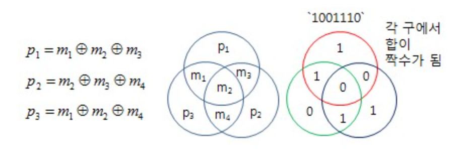

test  
$x \\, \\, \\, \\, y \\: \\: \\: \\: z \\; \\; \\; \\; a \\! \\! \\! \\! k$

#   (7,4) 해밍 코드
**특징**
-   유효 부호어 개수: $2^4 = 16$
-   신드롬 수: 8개($2^3 = 8$)
-   오류 정정 능력: 최대 1비트 오류 정정 가능
    >   최소 해밍거리가 3 이여서
-   닫힘 성징
    >   두 부호어의 합이 다시 또 다른 부호어가 됨
-   완전 부호
    >   모든 수신 부호어에 대해, 복호 실패 없이, 반드시 복호 가능


-   4개의 정보비트에 대한 3개의 검사 비트


$c_1 = x_1 + x_2 + x_3 \quad \quad$  
$c_2 = \\, \quad \quad x_2 + x_3 + x_4$  
$c_3 = x_1 + x_2  \quad \quad + x_4$




-   부호어 w 생성

$w = (x_1, x_2, x_3, x_4, c_1, c_2, c_3) = (w_1, w_2,w_3, w_4, w_5, w_6, w_7)$

---
| $X_1X_2X_3X_4$ | $C_1C_2C_3$ | $X_1X_2X_3X_4$ | $C_1C_2C_3$ |
| :---: | :---: | :---: | :---: |
| 0 0 0 0 | 0 0 0 | 0 0 0 1 | 0 1 1 |
| 1 0 0 0 | 1 0 1 | 1 0 0 1 | 1 1 0 |
| 0 1 0 0 | 1 1 1 | 0 1 0 1 | 1 0 0 |
| 1 1 0 0 | 0 1 0 | 1 1 0 1 | 0 0 1 |
| 0 0 1 0 | 1 1 0 | 0 0 1 1 | 1 0 1 |
| 1 0 1 0 | 0 1 1 | 1 0 1 1 | 0 0 0 |
| 0 1 1 0 | 0 0 1 | 0 1 1 1 | 0 1 0 |
| 1 1 1 0 | 1 0 0 | 1 1 1 1 | 1 1 1 |
---

$c_1 = x_1 + x_2 + x_3$  
$c_2 = \quad \quad x_2 + x_3 + x_4$  
$c_3 = x_1 + x_2  \quad \quad + x_4$


$w = (x_1, x_2, x_3, x_4, c_1, c_2, c_3) = (w_1, w_2,w_3, w_4, w_5, w_6, w_7)$

`위 두 식으로 아래 식 확인 가능`
  
$w_1 + w_2 + w_3 \quad \quad + w_5 \quad \quad \quad \quad  = 0$  
$\\, \quad \quad w_2 + w_3 + w_4 \quad \quad + w_6  \quad \quad = 0$  
$w_1 + w_2 \quad \quad + w_4 \quad \quad \quad \quad + w_7 = 0$

### 신드롬
수신어 $ y = (y_1, y_2, ... ,y_7) $

$ s_1 = y_1 + y_2 + y_3 \quad \quad + y_5 $<br>
$ s_2 = \quad \quad y_2 + y_3 + y_4 \quad \quad + y_6 $<br>
$ s_3 = y_1 + y_2 \quad \quad + y_4 \quad \quad \quad \quad+ y_7 $

-   $ y = w + e $ 대입하여 오류 확인

$ s_1 = e_1 + e_2 + e_3 \quad \quad + e_5 $<br>
$ s_2 = \quad \quad e_2 + e_3 + e_4 \quad \quad + e_6 $<br>
$ s_3 = e_1 + e_2 \quad \quad + e_4 \quad \quad \quad \quad+ e_7 $

| 오류 패턴<br>$e_1e_2e_3e_4e_5e_6e_7$ | 신드롬<br>$s_1s_2s_3$ |
| :---: | :---: |
| 1 0 0 0 0 0 0 | 1 0 1 |
| 0 1 0 0 0 0 0 | 1 1 1 |
| 0 0 1 0 0 0 0 | 1 1 0 |
| 0 0 0 1 0 0 0 | 0 1 1 |
| 0 0 0 0 1 0 0 | 1 0 0 |
| 0 0 0 0 0 1 0 | 0 1 0 |
| 0 0 0 0 0 0 1 | 0 0 1 |
| 0 0 0 0 0 0 0 | 0 0 0 |
---

#   해밍코드 패리티 비트의 해쉬 함수 기능 여부

-   해밍코드의 패리티 비트
    -   목적: 오류 검출
    -   작동방식: 단순 XOR 연산
    -   가역성: 양방향 -> 패리티 비트와 일부 데이터로 다른 데이터 유추 가능

-   해시함수
    -   목적: 데이터 무결성 검증 및 식별
    -   작동 방식: 수학적 연산을 통한 고정 길이 값 생성
    -   가역성: 단방향 -> 해시값으로 원본 데이터 추적 불가능

```
문제: 해밍코드의 패리티 비트는 해시 함수의 기능을 가질 수 있는가? 가/불 여부를 적고 그 이유를 서술하시오.
답: 불가능하다.

간단한 답: 해시함수의 기능을 가지면 오류 발생 사실 여부만 확인 가능, 오류 위치는 확인 불가 따라서 기능을 가질 수 없다

이유: 해밍코드의 패리티 비트와 해시 함수는 설계 목적과 핵심 동작 원리가 근본적으로 다르기 때문이다.

설계 목적의 차이
-   패리티 비트: 전송 과정에서 발생한 오류를 검출하고 수정하는 것이 주된 목적이다.

-   해시 함수: 데이터의 고유 식별 및 무결성 검증이 주된 목적으로, 데이터의 '지문'을 만드는 역할을 한다.

단방향성의 부재 (Not One-way)

-   해시 함수는 결과값(해시)으로 원본 데이터를 역추적할 수 없는 단방향성을 반드시 가져야 한다.

하지만 패리티 비트는 데이터 비트들과의 예측 가능한 XOR 연산으로 생성되므로, 그 관계가 명확하여 단방향성을 만족하지 못한다.

-   눈사태 효과의 부재 (No Avalanche Effect)

해시 함수는 원본 데이터가 단 1비트만 변경되어도 결과값 전체가 예측 불가능하게 완전히 달라지는 눈사태 효과를 가져야 한다.

반면, 패리티 비트는 원본 데이터의 1비트가 변경되면 그와 관련된 패리티 비트만 예측 가능하게 변경될 뿐, 결과 전체가 급격하게 변하지 않는다.
```
