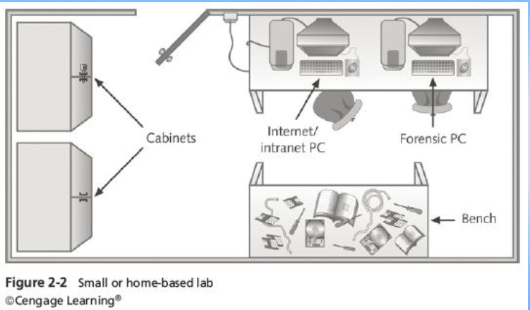
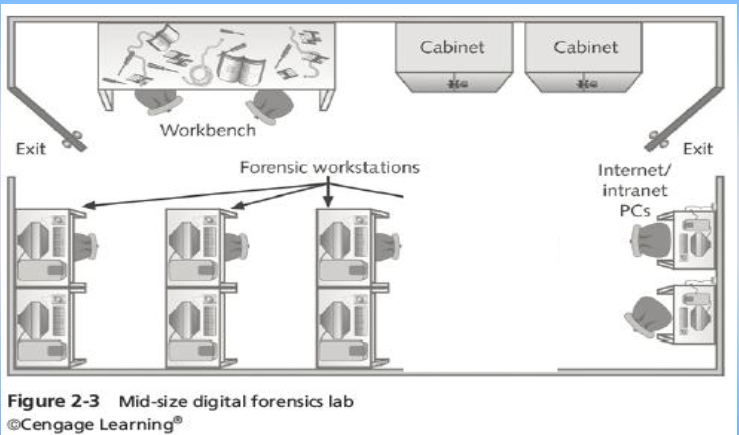
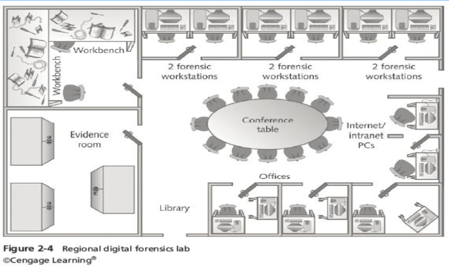

#   디지털 포렌식 수행 절자
-   OSCAR
    -   `Obtain information` 정보수집
    -   `Strategize` 전략 수립
    -   `Collect evidence` 증거 수집
    -   `Analyze` 분석
    -   `Report` 보고서

#   디지털 포렌식 기본 원칙
1.  정당성의 원칙
    -   입수 증거가 적법정차를 거쳐 얻어져야 함
    >   위법수집증거배제법칙  
    >   독수의 과실이론(위법하게 얻은 증거로 인한 2차 증거도 증거 능력 없음)
2.  재현의 법칙
    -   같은 조건에서 항상 같은 결과가 나와야 함
3.  신속성의 원칙
    -   전 과정은 지체 없이 신속하게 진행되어야 함
4.  연계보관성의 원칙
    -   증거물 `회득 - 이송 - 분석 - 보관 - 법정 제출`의 각 단계에서 담당자 및 책임자가 명확히 해야함
    -   수집된 하드디스크가 이송단계에서 물리적 손상이 있었다면 이송 담당자는 이를 확인하고 해당 내용을 인수인계, 이후 과정에서 복구 및 보고서 작성 등 적절한 조치 필요
```
증거를 발견하고 수집한 사람, 장소, 시간
증거를 취급하고 조사한 사람, 장소, 시간
증거를 보관하는 사람, 보관 기간, 보관 방식
증거 관리가 변경되었을 때의 이송 방법과 날짜 (선적 번호 포함)
```
5.  무결성의 원칙
    -   수집 증거가 위변조 되지 않았음을 증명
    >   수집 당시의 데이터 해시값과 법정 제출 시점 데이터의 해시값이 같다면 해시함수의 특성에 따라 무결성을 입증

#   디지털 증거의 증거능력 요건
1.  진정성
    -   법정에 제출한 증거가 요증사실을 성명하기 위한 바로 그 증거
    -   연계 보관성
2.  무결성
    -   증거 데이터가 수집 및 분석과정을 거쳐 법정에 제출되기까지 훼손 없이 안전하게 보호되는 것을 말함
3.  신뢰성
    -   증거 데이터의 분석 등 처리 과정에서 디지털 증거가 **위변조**되지 않았고 의도되거나 의도되지 않은 오류를 포함하지 않음을 의미
4.  원본성
    -   자체적으로 가시성과 가독이 없는 디지털 증거를 변환하여 제출하는 과정에서 제출되는 증거 데이터가 원 매체에 있는 데이터와 동일함을 의미
        >   인쇄물로 변환 출력의 경우 내용 같을시 인정  
        >   최량증거규칙
        >>  문서의 원본증거가 증거로서 그 내용을 증명하기 위해 제출되어야 한다

-   증거능력 여부
    1.  생성증거(기계가 자동 생성한 파일): 가능
        >   검색 기록, 로그 기록, 파일(hwp, doc, xls) 생성 이력 등
    2.  보관 증거(사람이 생성한 파일): 불가능
        >   파일(hwp, doc, xls)
        >   작성자 미동의시 미인정, 부인의 경우 특성정보에 의해 진정성 증명 필요
    +   디지털 증거의 복사본: 해시값 동일 경우 가능
    +   네트워크 정보의 증거력: 동일 해시값 데이터를 원본 인정
        >   네트워크 데이터는 실시간 변화 -> 수집 기간에 따라 해시값 변경 가능 -> 제 3자의 입회 하에 해시값 계산 및 공증

#   디지털 증거의 무결성 입증 방법
-   암호학적 해시 함수 -> 디지털 증거의 무결성 입증

| 해시 알고리즘(출력길이) | 보안수준(예측) | 근거 제시 |
| :--- | :--- | :--- |
| MD-5 (128-비트 해시값) | $2^{128/2} = 2^{64}$ 수준임 | Birthday-Paradox |
| SHA-1 (160-비트 해시값) | $2^{160/2} = 2^{80}$ 수준임 | Birthday-Paradox |
| SHA-256 (256-비트 해시값) | $2^{256/2} = 2^{128}$ 수준임 | Birthday-Paradox |
| SHA-512 (512-비트 해시값) | $2^{512/2} = 2^{256}$ 수준임 | Birthday-Paradox |

-   해시 함수 사용 이유
    1.  임의의 긴 입력값이라도 고정된 길이 해시값 출력(Fixed length)
    2.  해시값 출력으로부터 입력 값 유추 불가(One-way function)
    3.  서로 다른 2개의 입력이 같은 출력`같은 값이 안 나옴`(충돌 회피(Collision-free))

-   무결성 입증을 위한 증거 제시 방법
    1.  디지털 증거 획득(하드디스크 이미지)
    2.  획득 증거에 대한 해시 함수 적용
    3.  해시함수의 출력 값을 별도 보관
    4.  법정에서 디지털 증거의 해시값을 계산하여 처음 계산 해시값과 비교 검증

### 데이터 추출 기법
-   물리적 추출
    -   파일 시스템과 무관하게 물리적인 매체에서 데이터를 복구하고 식별하여 데이터 추출
-   논리적 추출
    -   설치된 운영체제, 파일 시스템, 응용 프로그램에 기반하여파일과 데이터를 복구하고 식별하여 데이터 추출

#   디지털 포렌식 연구소 평명도
-   소규모
    -   한 두개의 포렌식 워크 스테이션
    -   인터넷 가능한 실험용 컴퓨터
    -   공간 허용시 작업대 1대
    -   보관용 캐비닛
    <br>

-   중규모
    -   몇 대의 워크스테이션
    -   안전상의 이유로 최소 2개 이상의 출구
    -   기밀성을 위한 칸막이 또는 별도의 사무실 필요
    -   소프트웨어 및 하드웨어 관리를 위한 추가 라이브러리 공간
    <br>

-   대규모
    -   별도의 증거실 마련
    -   증거실 안팎의 트래픽 관리, 제어를 위한 한명 이상의 관리자 배정
    -   통제 가능 출구 최소 2개 이상, 창문 없어야 함
    <br>


